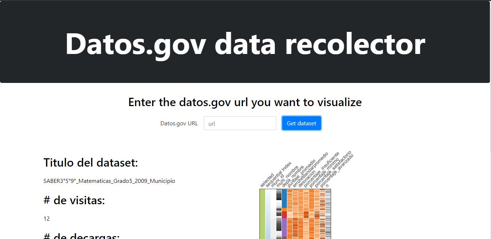
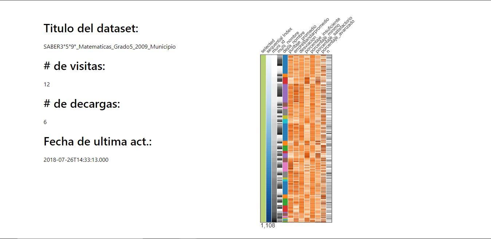

# Awesome Mini Proyect
## Author
- Sergio Naranjo Puentes

  [Personal Site](https://snaranjop1.github.io) - [GitHub](https://github.com/snaranjop1)

## Links

**Deployed at:** https://awesomeproyect.herokuapp.com/

## Description
This web app allows to create a visualization on a datos.org dataset and get the basic info of the dataset.
- I would like to be evalued with the second option (deadline tuesday 17 8:00pm)
- The creative component is the part of showing the dataset info, for this i had to go to the datos.gov data inventory dataset (https://www.datos.gov.co/Ciencia-Tecnolog-a-e-Innovaci-n/Inventario-de-datos-abiertos-del-portal-datos-gov-/gc9e-9mzf/data). Some datasets are not registered here so the component works with the ones registered like:

- https://www.datos.gov.co/resource/rn5x-txtx.json
- https://www.datos.gov.co/resource/ey95-rpvs.json
- https://www.datos.gov.co/resource/ghaq-4zn7.json
- https://www.datos.gov.co/resource/bda4-k8j4.json

## Technologies
This proyect was developed using the following technologies:

- For the client-side layer i used **React**
- for dataviz i used **navio**
- For the server-side layer i used **Node** and **Express**

## Objective
The objective of this proyect is to make a visualization of a dataset of the datos.gov API in order to make analisis over the data in a simplier way

## Instructions to execute

### Requisites

- **Node JS**

Verify that nodejs is installed by running "node -v" on terminal or cmd. It can be downloaded in https://nodejs.org/ (versión LTS)

### Steps to run develop version

1. On root folder run
```
npm run dev
```
2. The proyect should be running at localhost:3001

## Screenshots

### Main Menu




## Licence
[](https://opensource.org/licenses/MIT)

This repository has the standard MIT license. You can find it [here.](https://github.com/snaranjop1/awesomeProyect/blob/master/LICENSE)
